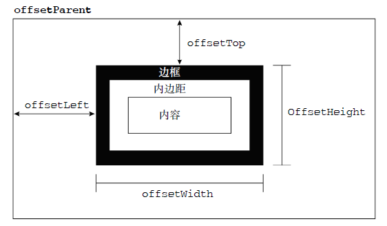
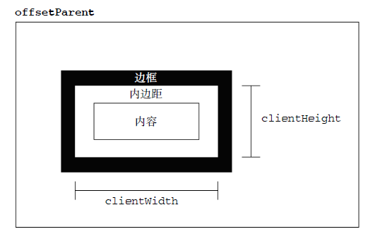
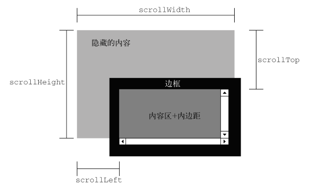
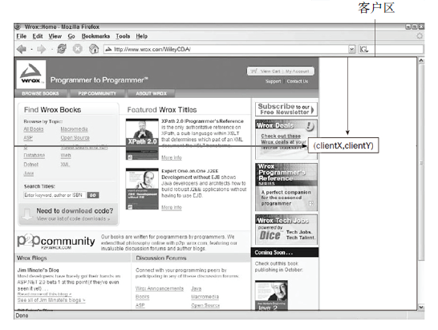
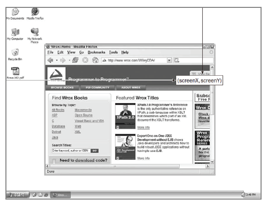

<h1>鼠标拖拽效果手把手教学</h1>

**目录**  
1. [先搞清楚几个属性](#chapter1)  
2. [实现原理](#chapter2)  
3. [最终结果及代码](#chapter3)

<h3 id="chapter1">1. 先搞清楚几个属性</h3>  
在实现拖拽效果之前，我们现在搞清楚几个属性：  

* <h5>元素的偏移量（offset）</h5>  
	- `offsetHeight`: 元素在垂直方向上占用的空间大小。即：`元素的高度 + 水平滚动条的高度 + border +　padding`  
	- `offsetWidth`: 元素在水平方向上占用的空间大小。即：`元素的宽度 + 垂直滚动条的宽度 +　border + padding`  
	- `offsetLeft`: `元素的左外边框`到`包含元素的左内边框`之间的像素距离。  
	- `offsetTop`: `元素的上外边框`到`包含元素的上内边框`之间的像素距离。  
	(offsetLeft和offsetTop属性和`包含元素`有关，`包含元素`的引用保存在`offsetParent`属性中。除非元素设置了position:absolute，不然默认的包含元素都是`<body>`)  

	图示：  
	  
	
* <h5>客户端大小（client）</h5>  
	- `clientHeight`: `元素内容区宽度 +　padding`  
	- `clientWidth`: `元素内容区高度 + padding`  

	图示：  
	  

* <h5>滚动大小（scroll）</h5>  
	- `scrollHeight`: 在没有滚动条的情况下，元素内容的总高度。  
	- `scrollWidth`: 在没有滚动条的情况下，元素内容的总宽度。  
	- `scrollLeft`: 被隐藏在内容区域左侧的像素数。通过设置这个属性可以改变元素的滚动位置。  
	- `scrollTop`: 被隐藏在内容区域上方的像素数。通过设置这个属性可以改变元素的滚动位置。  
	
	图示：  
	 

* <h5>鼠标事件的事件对象event的属性</h5>  
	- **客户区坐标位置**  
		`event.clientX` 和 `event.clientY`: 表示鼠标事件发生时鼠标指针在`客户区（视口）`中的水平和垂直坐标  
		图示：  
		  
	- **页面坐标位置**  
		`event.pageX` 和 `event.pageY`: 表示鼠标事件发生时鼠标指针在`整个页面`中的坐标位置。  
		`event.pageX = event.clientX + scrollLeft`  
		`event.pageY = event.clientY + scrollTop`  
	- **屏幕坐标位置**  
		`event.screenX` 和 `event.screenY`: 表示鼠标事件发生时鼠标指针相对于`整个显示屏幕`的坐标信息  
		图示：  
		  
<h3 id="chapter2">2. 实现原理</h3>  
每一次鼠标拖拽元素，背后其实都经历了3个鼠标事件：`鼠标按下（mousedown）`、`鼠标移动（mousemove）`、`鼠标松开（mouseup）`  

* 鼠标事件1—— **鼠标按下**  
	第一步，当鼠标在拖拽的元素上按下时，要完成两件事：  
	- 计算鼠标指针相对于拖拽元素左上角的坐标距离  
	- 标记元素为**可拖拽状态**  
	
	代码：  
	<pre>
	box.onmousedown = function(event) {
	    var e = event || window.event;
        var mouseCurrentX = e.clientX;  //鼠标当前位置
        var mouseCurrentY = e.clientY; 
	    mouseOffsetX = mouseCurrentX - box.offsetLeft; //鼠标相对于拖拽元素左边框的距离
	    mouseOffsetY = mouseCurrentY - box.offsetTop;  //鼠标相对于拖拽元素上边框的距离
	    isDragging = true;  //标记元素为可拖拽状态 
	}
	</pre>
* 鼠标事件2—— **鼠标移动**  
	第二步，当鼠标正在移动（拖拽元素）时，同样要完成两件事（但会复杂一点）：  
	- 更新拖拽元素的位置  
	- 判断拖拽元素是否有超出边界（客户区），不能让拖拽元素超出客户区  
	
	代码：  
	<pre>
	document.onmousemove = function(event) {
	    var e = event || window.event;
	    var mouseCurrentX = e.clientX;  //鼠标当前位置
        var mouseCurrentY = e.clientY;

        //拖拽元素的新位置
        var moveX  = 0;  // 元素左边框相对于可视区（客户区）左边的距离
        var moveY  = 0;  // 元素上边框相对于可视区（客户区）上边的距离

        if (isDragging === true) {
            //拖拽元素的新位置 = 鼠标当前坐标 - 鼠标相对于拖拽元素的坐标
            moveX = mouseCurrentX - mouseOffsetX;  
            moveY = mouseCurrentY - mouseOffsetY;

            //拖动范围：moveX > 0 并且 moveX < (可视区（客户区）最大宽度 - 拖拽元素的宽度)
            //         movey > 0 并且 movey < (可视区（客户区）最大高度 - 拖拽元素的高度)
            var pageWidth = document.documentElement.clientWidth;  //浏览器窗口的大小
            var pageHeight = document.documentElement.clientHeight;

            var maxX = pageWidth - box.offsetWidth;
            var maxY = pageHeight - box.offsetHeight;

            moveX = Math.min( maxX, Math.max(0, moveX) );  // 0 < moveX < maxX
            moveY = Math.min( maxY, Math.max(0, moveY) );  // 0 < moveY < maxY

            box.style.left = moveX + "px";
            box.style.top = moveY + "px";
        }		
	}
	</pre>
* 鼠标事件3—— **鼠标松开**  
	第三步，当鼠标松开时，只需要另拖拽元素的状态变为不可拖拽即可。  
	代码：  
	<pre>
    document.onmouseup = function() {
      isDragging = false;
    };
	</pre>

<h3 id="chapter3">3. 最终结果及完整代码</h3>  
点[这里](https://allenmind.github.io/drag-element/index.html)
